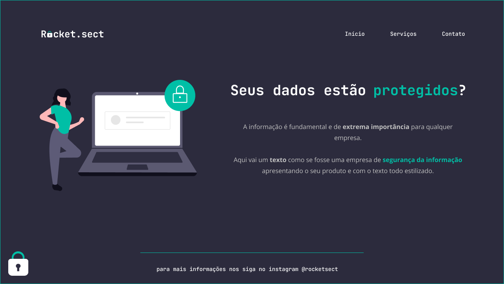

<h1 align="center"> Explorer Challenges 01</h1>

Desafio 04 do Stage 02 do Programa Explorer

  <a href="#-tecnologias">Tecnologias</a>&nbsp;&nbsp;&nbsp;|&nbsp;&nbsp;&nbsp;
  <a href="#-projeto">Projeto</a>&nbsp;&nbsp;&nbsp;|&nbsp;&nbsp;&nbsp;
  <a href="#clock1-planos-futuros">Planos Futuros</a>&nbsp;&nbsp;&nbsp;|&nbsp;&nbsp;&nbsp;
  <a href="#memo-licença">Licença</a>

  

 

  

## 🚀 Tecnologias

- Esse projeto foi desenvolvido com as seguintes tecnologias:

    - HTML
    - CSS

## 💻 Projeto

- O Projeto "Rocket.sect" consiste em uma land page desenvolvida ao final do Stage 2 - Módulo de introdução ao HTML e CSS.

- O Objetivo do exercicio é criar um código do zero a partir de um layout do figma.

## 🕐 Planos Futuros

- Implementar os conceitos de:

    - Acessibilidade ✔️
    - Responsividade ✔️

## 📝 Licença

- Esse projeto está sob a licença MIT.

---

Feito com :heart: por Vitor Sousa 🚀🚀